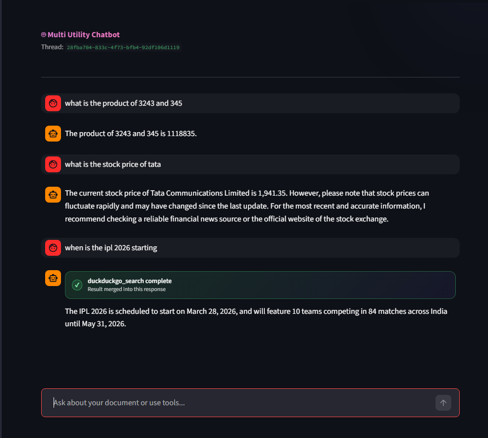
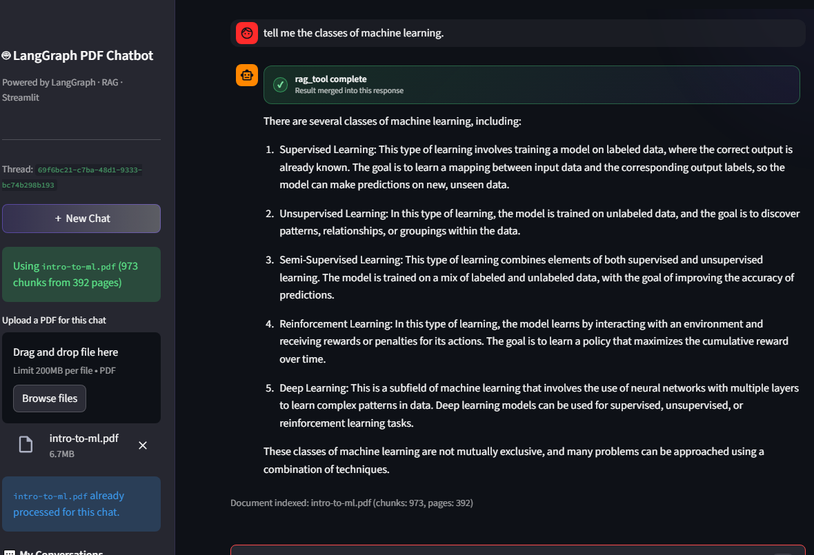

# 🤖 LangGraph Multi-Utility RAG Chatbot


A **production-style conversational AI chatbot** built with **LangGraph**, **LangChain**, and **Streamlit**, powered by **Groq's ultra-fast Llama-3.3-70B inference**.

The system supports:

- Persistent **multi-turn conversations**
- **Document question answering (RAG)**
- **External tool calling**
- **Multiple chat threads**
- **SQLite-based state persistence**

This project demonstrates **agent orchestration using LangGraph** with **real-world features found in modern AI assistants**.

---

# 📚 Table of Contents

- [Demo](#-demo)
- [Features](#-features)
- [Architecture](#-architecture)
- [Project Structure](#-project-structure)
- [Installation](#-installation)
- [Running the App](#-running-the-app)
- [Data Persistence](#-data-persistence)
- [Tech Stack](#-tech-stack)
- [Dependencies](#-dependencies)
- [Future Improvements](#-future-improvements)
- [License](#-license)

---

# 🚀 Demo

## Chat Interface



## Threaded Conversations



---

# ✨ Features

## 🧠 Persistent Chat Memory
- Uses **LangGraph `SqliteSaver`** for state management
- Conversations stored in **SQLite (`chatbot.db`)**
- Each chat uses a unique `thread_id`

---

## 📄 Retrieval-Augmented Generation (RAG)

Users can upload **PDF documents** and ask questions about them.

Pipeline:

1. PDF loaded using **PyPDFLoader**
2. Text chunked using **LangChain**
3. Stored in **FAISS vector database**
4. Relevant chunks retrieved during queries

---

## ⚡ Tool Calling

The chatbot can call external tools:

- 🔎 DuckDuckGo Search
- 📈 Stock Price Lookup
- 🧮 Calculator

These tools are automatically invoked through **LangGraph tool execution**.

---

## 💬 Multi-Thread Conversations

Users can:

- Create new chats
- Switch between conversations
- Resume previous chats

All conversation history persists in SQLite.

---

## ⚡ Streaming Responses

Responses stream token-by-token for a **real-time chat experience**.

---

# 🏗️ Architecture

## 🏗️ Architecture

```
┌─────────────────────────────────────────────────────────┐
│                   User (Web Browser)                    │
│           Chat Interface · PDF Upload · Threads         │
└───────────────────────┬─────────────────────────────────┘
                        │
                        │ HTTP Requests
                        ▼
┌─────────────────────────────────────────────────────────┐
│                     Streamlit Frontend                  │
│  Chat UI · Thread Manager · Streaming Responses · RAG   │
└───────────────────────┬─────────────────────────────────┘
                        │
                        │ Query / State / Tool Calls
                        ▼
┌─────────────────────────────────────────────────────────┐
│                 LangGraph Agent Workflow                │
│  Conversation Orchestration · Tool Routing · RAG Logic  │
└───────┬───────────────────────────┬─────────────────────┘
        │                           │
        │                           │
        ▼                           ▼
┌───────────────┐          ┌──────────────────────────────┐
│   Groq LLM    │          │     FAISS Vector Store       │
│ Llama-3.3-70B │          │   Document Embeddings (RAG)  │
│ Fast Inference│          │   PDF Chunk Retrieval        │
└───────────────┘          └──────────────────────────────┘
        │
        │ Tool Execution
        ▼
┌─────────────────────────────────────────────────────────┐
│                     External Tools                      │
│  DuckDuckGo Search · Stock Price API · Calculator       │
└─────────────────────────────────────────────────────────┘

                ┌───────────────────────────┐
                │       SQLite Memory       │
                │  Chat History Persistence │
                │     thread_id storage     │
                └───────────▲───────────────┘
                            │
                            │
                      LangGraph State
```

### System Flow

1. **User interacts with the Streamlit UI**
2. **LangGraph orchestrates conversation logic**
3. **Groq LLM generates responses**
4. **Tools execute when required**
5. **RAG retrieves context from FAISS**
6. **SQLite persists chat state**

---

# 📂 Project Structure

```
chatbot/
│
├── langraph_rag_backend.py
│   LangGraph backend (LLM, tools, RAG pipeline)
│
├── streamlit_rag_frontend.py
│   Streamlit UI and chat thread manager
│
├── chatbot.db
│   SQLite database storing conversation history
│
├── requirements.txt
│   Python dependencies
│
├── pyproject.toml
│   Project metadata
│
├── image.png
│   UI screenshot
│
└── README.md
```

---

# ⚙️ Installation

## 1️⃣ Clone the repository

```bash
git clone https://github.com/SahilGG-4545/chatbot.git
cd chatbot
```

---

## 2️⃣ Create a virtual environment

Using **uv (recommended)**

```bash
uv venv
source .venv/bin/activate
```

Using **venv**

```bash
python -m venv .venv
```

Activate:

**Windows**

```bash
.venv\Scripts\activate
```

**Mac / Linux**

```bash
source .venv/bin/activate
```

---

## 3️⃣ Install dependencies

```bash
pip install -r requirements.txt
```

---

## 4️⃣ Configure environment variables

Create a `.env` file in the project root:

```
GROQ_API_KEY=your_groq_api_key
```

Get a free API key from:

https://console.groq.com

---

# ▶️ Running the App

Start the Streamlit application:

```bash
streamlit run streamlit_rag_frontend.py
```

Open the app:

```
http://localhost:8501
```

---

# 💾 Data Persistence

Chat history is stored in:

```
chatbot.db
```

Each conversation uses a unique:

```
thread_id
```

---

# 🧰 Tech Stack

| Layer | Technology |
|------|-------------|
| LLM Inference | Groq (Llama-3.3-70B) |
| Agent Framework | LangGraph |
| LLM Tooling | LangChain |
| Vector Store | FAISS |
| Embeddings | HuggingFace MiniLM |
| Backend | Python |
| Frontend | Streamlit |
| Persistence | SQLite |

---

# 📦 Dependencies

```
langgraph
langgraph-checkpoint-sqlite
langchain-core
langchain-openai
langchain-community
faiss-cpu
sentence-transformers
duckduckgo-search
pypdf
python-dotenv
streamlit
```

---

# 📌 Future Improvements

- Multi-document RAG support
- Chat memory summarization
- Web search ranking improvements

---

# 🤝 Contributing

Contributions are welcome!

1. Fork the repo
2. Create a feature branch
3. Commit your changes
4. Open a Pull Request

---

# 📜 License

MIT License

---

⭐ If you found this project useful, consider **starring the repository**!